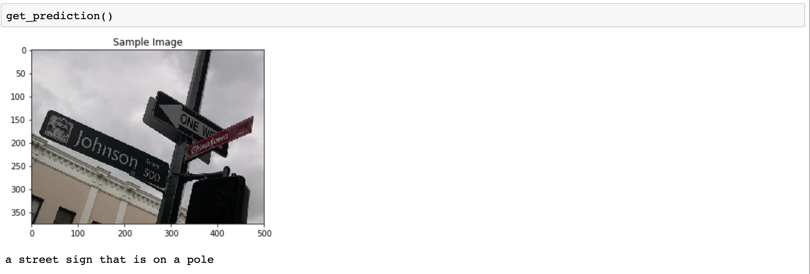
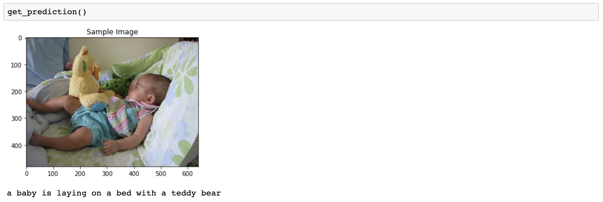
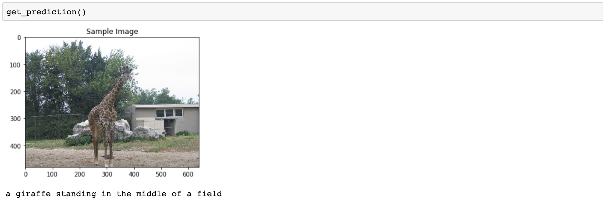
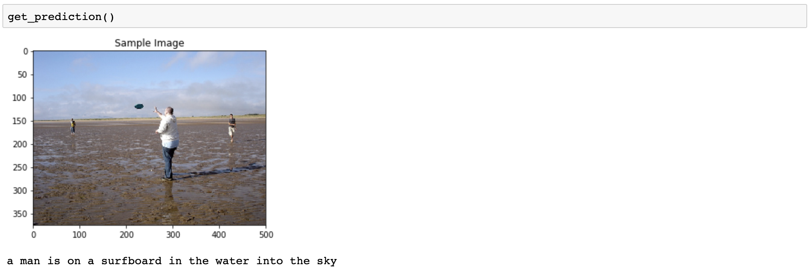

# Image Captioning with Deep Learning
> Leveraging CNN-RNN architectures to generate descriptive captions for images.

This project demonstrates the application of Convolutional Neural Networks (CNN) and Recurrent Neural Networks (RNN) to create a sophisticated image captioning system. By combining these models, we can interpret the content of images and generate relevant textual descriptions, showcasing the intersection of computer vision and natural language processing.

### Dataset
Utilizes the Microsoft Common Objects in COntext (MS COCO) dataset, a benchmark for evaluating scene understanding and image captioning algorithms. More information can be found on the [MS COCO website](http://cocodataset.org/#home) and in the [comprehensive research paper](https://arxiv.org/pdf/1405.0312.pdf).

### Encoder-Decoder Architecture
- **Encoder**: Employs a pre-trained ResNet-50 model to extract features from images. The model's architecture allows for a deep understanding of visual content, essential for accurate caption generation.
  
  

- **Decoder**: Uses an LSTM network to translate the visual features into coherent captions. This approach exemplifies the combination of visual and linguistic AI technologies to create meaningful text descriptions.
  
  

The model underwent training for 3 epochs, with parameters informed by cutting-edge research ([Paper 1](https://arxiv.org/pdf/1502.03044.pdf), [Paper 2](https://arxiv.org/pdf/1411.4555.pdf)), ensuring the system is grounded in proven methodologies.

### Predictions
#### Valid Captions
- Demonstrates the model's ability to generate accurate and relevant captions, reflecting a deep understanding of both the image content and how to describe it in natural language.

  
  
  

#### Questionable Captions
- Highlights areas for improvement and adjustment, underscoring the ongoing development and refinement process of ML models.

  

### Future Directions
- **Enhanced Model Training**: Plans to further refine the training process, exploring more advanced neural network architectures and training strategies to improve caption accuracy and relevance.
- **Interdisciplinary Collaboration**: Seeking opportunities for collaboration across AI, ML, and NLP domains to push the boundaries of what's possible in automated image understanding and description.
- **Application Development**: Aim to integrate this model into broader applications, enhancing user experiences by providing contextual understanding of images across various platforms.
