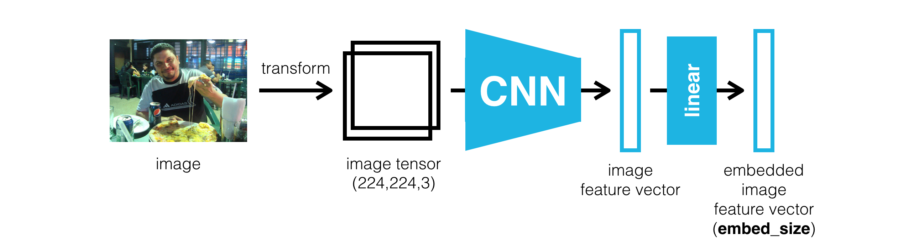

# Image_Captioning
Using CNN-RNN model to generate captions for images

### Dataset
The Microsoft Common Objects in COntext (MS COCO) dataset is a large-scale dataset for scene understanding. The dataset is commonly used to train and benchmark object detection, segmentation, and captioning algorithms. [website](http://cocodataset.org/#home) or in the [research paper](https://arxiv.org/pdf/1405.0312.pdf).

### Encoder and Decoder
The encoder uses the pre-trained ResNet-50 architecture (with the final fully-connected layer removed) to extract features from a batch of pre-processed images.  The output is then flattened to a vector, before being passed through a `Linear` layer to transform the feature vector to have the same size as the word embedding.

The decoder uses a LSTM model to process the input vector from the encoder

The model was trained for 3 epochs with parameter values obtained from [this paper](https://arxiv.org/pdf/1502.03044.pdf) and [this paper](https://arxiv.org/pdf/1411.4555.pdf). 

### Predictions
#### Valid Captions

#### Questionable Captions

